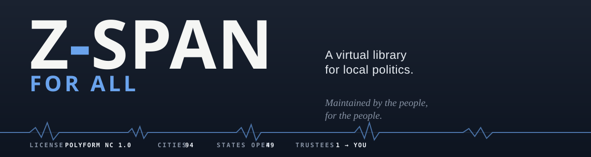

  

> The CIA, the NSA, and even the Pentagon are bounded by the finite tenure of the humans who staff them.
>
> **Z-Span is not.**
>
> Z-Span is powered by the people, for the people, and thus requires full community involvement and transparency.
>
> If you would like to operate this library for your own country, [here is how.](documents/respawn-kernel/README.md)
>
> — Z-SPAN operator

## The Z-SPAN Trinity

---

[TEMPORARILY DRAFTED BY AI. WILL BE REWRITTEN BY 8/10/2026]

[**English**](README.md) · [العربية](README.ar.md) · [Español](README.es.md) · [فارسی](README.fa.md) · [Français](README.fr.md) · [हिन्दी](README.hi.md) · [Bahasa Indonesia](README.id.md) · [Filipino](README.fil.md) · [Português (Brasil)](README.pt-BR.md) · [Kiswahili](README.sw.md) · [简体中文](README.zh-CN.md) · [繁體中文](README.zh-TW.md) · [Tiếng Việt](README.vi.md)

**A virtual library for local politics.**

[Visit Z-SPAN at zspan.org](https://zspan.org)

✨ **Published in full, for anyone, maintained by everyone.**

Z-SPAN is an attempt to make local public meetings easier to find, watch, and
understand. Places become channels, meetings become episodes, and the original
videos, agendas, and minutes remain part of the path.

This repository is the whole library. Earlier versions published a curated
shelf of reference material; this one publishes the working machinery itself —
every city parser in the clear, the interface, the transcription pipeline, the
per-county civic data, and the tools for adding a place that is not here yet.
The reason is simple: a library maintained by one person ends with that
person. A library maintained by its readers does not end.

That is the model. You do not host your own copy of Z-SPAN — there is one
library, and it grows because people add and tend the shelf for the place
they live. A city is an afternoon of work. The [starter kit](documents/starter-kit/)
walks you through it, and your name goes on the shelf you keep.

## Watch the complete walkthrough

[**Z-SPAN Is Born**](https://www.youtube.com/watch?v=HTpR9jRl314) walks through
the founding library from the operator's perspective. Watch it first for the
complete picture of what Z-SPAN is, how the pieces fit together, and what the
public path is intended to carry forward.

## 🗺️ Where trustees are needed

Every state is a shelf in the library. A green shelf is covered and current.
An amber shelf is an open seat — and some open seats come with a head start.

| State | Status | Notes |
|---|---|---|
| 🟢 Arizona | Live | 94 cities registered · Kingman and Mohave County showcase · the founding shelf |
| 🟠 Nevada | Trustee needed | A first parser round is already written — inherit it and go |
| 🟠 Utah | Trustee needed | 256 cities reconned — the endpoint archive is ready |
| 🟠 Virginia | Trustee needed | 226 jurisdictions reconned — the endpoint archive is ready |
| ⬜ Your state | Open seat | Nobody has to invite you. Start with your own city. |

Per-city coverage lives in [`brain/`](brain/) — one file per county, holding
that county's cities, their calendar sources, and their current freshness. If
a shelf goes stale, that is visible to everyone, not just to us.

## Add your city

1. **Copy the [starter kit](documents/starter-kit/) template** — fill in your city's
   meeting-portal address, its vendor type (Granicus, Legistar, CivicClerk,
   or a YouTube channel), and the council roster from the city's own
   official page.
2. **Run the freshness probe** — it proves the endpoint answers before you
   open a pull request.
3. **Open the pull request.** When it merges, the city is yours to keep
   current, and your name joins the trustees table below.

## 🌌 Build it for another country

Start with the [Respawn Kernel](documents/respawn-kernel/README.md). Give it a country,
a locally chosen project name, and a primary language. It creates a separate
repository with country-neutral data contracts, a recursive jurisdiction
model, translation support, validation tools, and a standalone public library
that can be expanded one verified place at a time.

Any country, no exceptions. From the United States of America, to the
People's Republic of China. The kernel studies the governing structure and
public sources that actually exist, records uncertainty instead of inventing
facts, and adapts the library to that setting. It does not decide what people
should do with the library. Each independent project owns its name, sources,
decisions, publication choices, and responsibility.

The complete path is public:

1. Read the [country bootstrap](documents/respawn-kernel/BOOTSTRAP.md).
2. [Create a country seed](documents/respawn-kernel/README.md#create-a-country-seed).
3. Research and verify one jurisdiction from source to rendered meeting.
4. Continue through the country's real jurisdiction graph with a human
   deciding what is published.

## 📚 Why this library exists

Projects that work with local public records tend to meet the same questions:

- How should someone browse meetings when government websites organize them
  differently?
- How can one interface remain useful across different cities and video
  providers?
- How can the path back to an official source stay obvious?
- How can technical systems explain themselves without making people read the
  database underneath them?

Z-SPAN is one working answer, not the only answer. The goal of this
repository is to leave the whole of it visible — examined, questioned, and
carried farther by the people who use it.

## 👋 Who this library is for

Whether you are a student, activist, journalist, researcher, designer,
developer, volunteer, or simply curious about local public information, you
do not need to adopt the whole project to find something useful here. The
library is organized so one idea or component can be understood at a time —
and so one city can be added at a time.

## 🗂️ How the repository is organized

- [`parsers/`](parsers/) — every city's calendar parser, in the clear,
  organized by state and county: `parsers/Arizona/Mohave/kingman_parser.py`.
  This is the shelf trustees tend.
- [`website/`](website/) — the interface: the channel guide, the show pages,
  the player, and all the artwork. Published so its pieces can be studied and
  carried into other work.
- [`transcription/`](transcription/) — the processing chain that turns a
  meeting recording into a grounded, checkable record.
- [`brain/`](brain/) — the civic data: one file per county with its cities,
  councils, calendar sources, and coverage state.
- [`documents/starter-kit/`](documents/starter-kit/) — templates and a walkthrough for adding
  your city.
- [`documents/respawn-kernel/`](documents/respawn-kernel/) — the runnable country-library
  starter, for taking the idea to a whole new country.
- [`documents/`](documents/) — how the record is made, the neutrality rules,
  and the commitments the project holds itself to.

## What this project commits to

These are constraints the project holds itself to, not aspirations:

- **No editorializing about public officials.** Their words are surfaced
  verbatim, attributed, and sourced. The judgment is yours.
- **No data aggregation on private citizens.** Officials acting in their
  public roles are the subject of this work; residents speaking at a public
  mic are not profiled.
- **Reading is never gated.** No paywall, subscription, login wall, or
  registration to read public-record content.
- **No engagement optimization.** No infinite feeds, no recommendation
  algorithms, no outrage mechanics. The record is calm on purpose.
- **A human reviews before anything publishes.** The pipeline is automated;
  publication is not.
- **Philanthropic, permanently.** This project is not a money maker, and the
  license makes that structural.

## 🏛️ City trustees

The people keeping their town's shelf current. One city, one trustee, one
name — this is what maintains the library.

| Trustee | City | Since |
|---|---|---|
| [@anitacigawet](https://github.com/anitacigawet) | Kingman, Arizona · founding trustee | 2026 |
| *your name* | *your city* | — |

## ⚖️ License

The published code is available under the
[PolyForm Noncommercial License 1.0.0](LICENSE). It may be studied, adapted,
shared, and reused for noncommercial purposes under the license terms. That
includes personal study, hobby projects, education, public research,
charitable work, and government use.

Commercial use is not granted by this license. Nobody gets to take the
people's record and sell it back to them. The required attribution and Z-SPAN
name boundary are recorded in the [NOTICE](NOTICE).

## Contact

Project hosted at [zspan.org](https://zspan.org). If you'd like an open seat
in the Z-SPAN ecosystem, contact
[anitacigawet@pm.me](mailto:anitacigawet@pm.me) for info.
