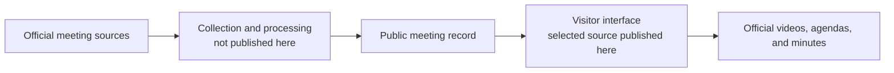

[TEMPORARILY DRAFTED BY AI. WILL BE REWRITTEN BY 8/4/2026]

# The project model

Z-SPAN begins with a simple problem: local public meetings exist, but finding
and following them often means learning a different website, archive, and set
of labels for every place.

The project presents those records through a shared visitor experience while
keeping the original public sources within reach.

## One simple path

This diagram is intentionally conceptual. It explains the relationship a
reader needs in order to understand the published interface without exposing
or pretending to document systems that are outside this repository.

## A place is the starting point

Most people do not arrive with a database identifier or a vendor name. They
arrive with a place in mind.

The channel and city views therefore begin with geography: state, county,
city, then the meetings associated with that place. Search provides a second
entrance for someone who begins with a subject instead.

## Meetings are presented as things people can enter

The interface borrows familiar ideas from television and libraries. A place
can feel like a channel. A meeting can feel like an episode. A guide can show
what is available now or nearby.

Those metaphors are navigation aids, not claims that civic records are
entertainment. Their purpose is to make unfamiliar public information feel
approachable without changing the underlying record.

## The source remains part of the experience

An agenda, minutes document, or official recording should not disappear behind
the interface that organizes it. Where the source is available, the visitor
can follow the path back to it.

That principle appears throughout the published source: meeting views expose
official links, search results keep documents close to the result, and the
player can hand someone back to the original host.

## Different entrances can share one record

The same meeting may be reached by browsing a place, searching a subject,
opening the guide, or following an integrity check. These entrances serve
different questions, but they should converge on the same public record rather
than create competing versions of it.

## Trust should have a visible path

The audit and watermark views demonstrate another part of the model: when a
project makes an integrity claim, a visitor should have somewhere to inspect
what that claim means.

The server-side verification systems are not published here. What is visible
is the interface boundary—the part that receives a result and explains it to a
person.

## What to carry into another project

The most portable idea is not Z-SPAN's exact page structure. It is the order of
attention:

1. Begin with the place or question a person already has.
2. Organize records consistently without hiding their differences.
3. Keep official sources visible.
4. Let several entrances lead back to one understandable record.
5. Explain trust in language a visitor can read.

The companion guide,
[`DESIGN_PATTERNS.md`](DESIGN_PATTERNS.md), connects these ideas to the
published components.
