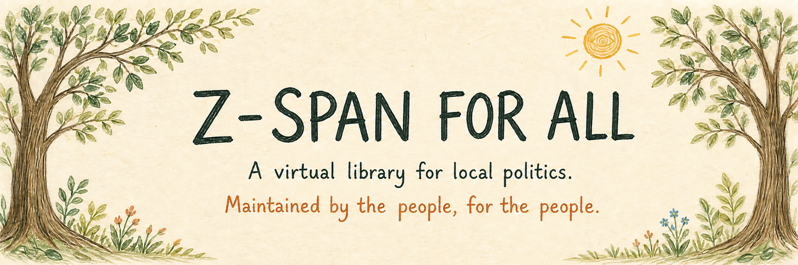
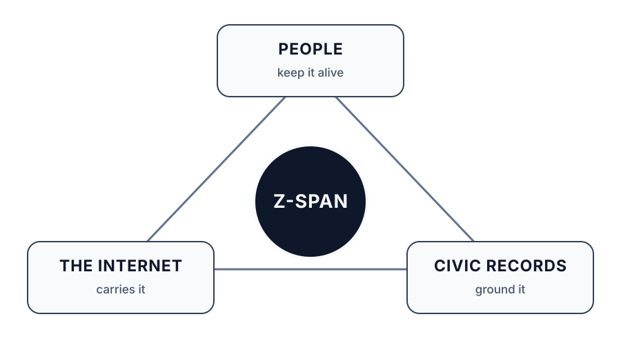

  

> *Scientia potentia est.*
>
> **Tri thức là sức mạnh.**
>
> — Francis Bacon

---

[English](../README.md) · [العربية](README.ar.md) · [Español](README.es.md) · [فارسی](README.fa.md) · [Français](README.fr.md) · [हिन्दी](README.hi.md) · [Bahasa Indonesia](README.id.md) · [Filipino](README.fil.md) · [Português (Brasil)](README.pt-BR.md) · [Kiswahili](README.sw.md) · [简体中文](README.zh-CN.md) · [繁體中文](README.zh-TW.md) · [**Tiếng Việt**](README.vi.md)

**Một thư viện trực tuyến về chính trị địa phương.**

[Truy cập Z-SPAN tại zspan.org](https://zspan.org)

✨ **Được công bố đầy đủ cho mọi người. Được mở rộng với sự giúp đỡ của mọi người.**

Z-SPAN là một nỗ lực giúp các cuộc họp công khai ở địa phương trở nên dễ tìm,
dễ xem và dễ hiểu hơn. Mỗi địa phương trở thành một kênh, mỗi cuộc họp trở
thành một tập, còn video, chương trình nghị sự và biên bản gốc luôn nằm trong
đường dẫn tra cứu.

Kho mã này chứa chính thư viện đang hoạt động: trang web, API công khai, các
trình phân tích nguồn họp, quy trình xử lý, ứng dụng cục bộ và những phép kiểm
tra giúp nội dung được tạo ra luôn gắn với hồ sơ công khai. Lý do công bố toàn
bộ bộ máy rất đơn giản: một thư viện do một người duy trì sẽ kết thúc cùng
người đó. Một thư viện mà người khác có thể xem xét, vận hành, đặt câu hỏi và
tiếp tục phát triển thì không.

Danh mục các nguồn họp của cơ quan công quyền được lưu riêng trong
[National Civics Catalog](https://github.com/anitacigawet/national-civics-catalog).
Kho đó chứa các điểm truy cập công khai lâu dài và bằng chứng—không chứa trình
phân tích của Z-SPAN, bản chép lời, bản tóm tắt hay cuộc họp đã xử lý. Z-SPAN
chỉ là một ví dụ về những gì có thể được xây dựng từ danh mục ấy.

## Xem phần giới thiệu đầy đủ

[**Z-SPAN Is Born**](https://www.youtube.com/watch?v=HTpR9jRl314) giới thiệu
thư viện Arizona đầu tiên từ góc nhìn của người vận hành. Video cho thấy hình
dung ban đầu về Z-SPAN, cách các phần kết nối với nhau và con đường công khai
mà dự án muốn mọi người tiếp tục phát triển.

## 🗺️ Một danh mục toàn quốc, được xây dựng từng địa phương

Arizona là mô hình thử nghiệm công khai mà Z-SPAN hiện đang xử lý và công bố.
Danh mục kênh cũng tạo cho mỗi tiểu bang và vùng lãnh thổ một cấu trúc khởi
đầu thực sự, được sắp xếp theo các cơ quan công quyền cấp tiểu bang, đơn vị
tương đương quận, bộ lạc, khu vực và địa phương.

Các kệ màu xanh có những cuộc họp đã được Z-SPAN công bố. Các kệ màu hổ phách
là những phần việc đang được thực hiện một cách minh bạch: địa phương đã có
trong danh mục, nhưng nguồn họp lâu dài hoặc trình phân tích Z-SPAN của nơi đó
vẫn cần được hoàn thiện. Không ai phải chờ lời mời mới có thể giúp cộng đồng
của mình.

## 🐈 Giúp quê hương của bạn

1. Tìm tiểu bang và địa phương của bạn tại [zspan.org](https://zspan.org).
2. Nếu kệ vẫn đang chờ, hãy bấm vào chú mèo đang ngủ.
3. Sao chép bản bàn giao Markdown ngắn vào trợ lý AI mà bạn đang dùng.
4. Trả lời một vài câu hỏi thông thường về địa phương và trang họp chính thức
   của nơi đó. Bạn không cần biết JSON hay Git.
5. Nếu có công cụ GitHub, trợ lý có thể chuẩn bị một pull request tập trung để
   bạn xác nhận. Nếu không có, trợ lý sẽ chuẩn bị một báo cáo đầy đủ cho biểu
   mẫu GitHub đơn giản.

Nội dung đóng góp được gửi đến National Civics Catalog, nơi một trình kiểm tra
đáng tin cậy và một con người sẽ xem xét điểm truy cập cùng bằng chứng của nó.
Nội dung đó không bao giờ được công bố trực tiếp lên Z-SPAN.

**Cam kết ba ngày của Z-SPAN:** sau khi một đóng góp cho danh mục được chấp
nhận, trong vòng ba ngày Z-SPAN sẽ tạo trình phân tích tương ứng hoặc đăng một
kết quả hiển thị rõ rằng nguồn đang bị cản trở. Cam kết này là về việc làm cho
nguồn có thể sử dụng được hoặc giải thích trung thực vì sao chưa thể sử dụng—
không phải về việc tự động công bố nội dung cuộc họp do AI tạo ra.

[Đọc hướng dẫn đóng góp bằng AI](https://github.com/anitacigawet/national-civics-catalog/blob/main/contribute/AI-INSTRUCTIONS.md)

## 📚 Vì sao thư viện này tồn tại

Các dự án làm việc với hồ sơ công khai địa phương thường gặp cùng những câu hỏi:

- Mọi người nên duyệt các cuộc họp thế nào khi mỗi trang web chính quyền sắp
  xếp chúng theo một cách khác?
- Làm sao một giao diện vẫn hữu ích ở nhiều địa phương và với nhiều nhà cung
  cấp video khác nhau?
- Làm sao đường dẫn trở về nguồn chính thức luôn rõ ràng?
- Làm sao hệ thống kỹ thuật có thể tự giải thích mà không buộc mọi người phải
  đọc cơ sở dữ liệu bên dưới?

Z-SPAN là một câu trả lời đang hoạt động, không phải câu trả lời duy nhất. Mục
tiêu của kho mã này là để toàn bộ dự án luôn hiện hữu—được xem xét, chất vấn
và tiếp tục phát triển bởi những người sử dụng nó.

## 👋 Thư viện này dành cho ai

Dù bạn là học sinh, sinh viên, nhà hoạt động, nhà báo, nhà nghiên cứu, nhà
thiết kế, lập trình viên, tình nguyện viên hay chỉ đơn giản là tò mò về thông
tin công khai tại địa phương, bạn không cần áp dụng toàn bộ dự án để tìm thấy
điều hữu ích ở đây. Thư viện được tổ chức để mỗi lần có thể hiểu một ý tưởng
hoặc một thành phần—và mỗi lần có thể thêm một địa phương.

## 🗂️ Cách tổ chức kho mã này

- [council_navigator](../02_Core_Project/council_navigator/) — trang web, API
  công khai, bộ nhớ đệm cuộc họp cục bộ và danh mục kênh công khai.
- [parsers](../02_Core_Project/council_navigator/parsers/) — các trình phân
  tích lịch dành riêng cho từng nguồn, chuyển điểm truy cập trong danh mục
  thành một cấu trúc cuộc họp chung.
- [zspan_pipeline](../02_Core_Project/zspan_pipeline/) — hàng đợi xử lý chuyển
  bản ghi cuộc họp thành nội dung có căn cứ và có thể xem xét.
- [zspan_cli](../02_Core_Project/zspan_cli/) — ứng dụng cục bộ để sử dụng
  Z-SPAN trên máy tính và không gian làm việc của mỗi người.
- [prompts](../02_Core_Project/prompts/) — các quy ước tổng hợp đã công bố,
  được sử dụng trong quy trình xử lý.

National Civics Catalog vẫn là một kho riêng để mọi người có thể cải thiện
danh mục nguồn mà không thay đổi ứng dụng Z-SPAN, đồng thời cho phép các dự án
khác dùng cùng những điểm truy cập ấy cho các mục đích hoàn toàn khác.

## Những điều dự án cam kết

Đây là những giới hạn dự án tự ràng buộc mình phải tuân theo, không chỉ là
mong muốn:

- **Không bình luận thiên lệch về các quan chức.** Lời nói của họ được trình
  bày nguyên văn, ghi rõ người nói và nguồn. Việc đánh giá là của bạn.
- **Không tổng hợp dữ liệu về công dân bình thường.** Công việc này tập trung
  vào các quan chức khi họ thực hiện vai trò công; cư dân phát biểu trước
  micro công cộng không bị lập hồ sơ.
- **Việc đọc không bao giờ bị chặn.** Không cần trả phí, đăng ký, đăng nhập hay
  thuê bao để đọc nội dung hồ sơ công khai đã xuất bản.
- **Không tối ưu hóa mức độ tương tác.** Không có dòng nội dung vô tận, thuật
  toán đề xuất hay cơ chế kích động phẫn nộ. Hồ sơ được giữ bình tĩnh có chủ ý.
- **Một con người xem xét trước khi bất cứ điều gì được công bố.** Việc xử lý
  có thể tự động; việc công bố thì không.
- **Được thiết kế cho mục đích phi thương mại.** Giấy phép biến ranh giới này
  thành một phần của cấu trúc.

## 🏛️ Người gìn giữ từ thuở đầu

Z-SPAN bắt đầu tại Arizona và được duy trì bởi
[@anitacigawet](https://github.com/anitacigawet). Những người đóng góp cho
danh mục nguồn được ghi nhận trong National Civics Catalog; phần triển khai
Z-SPAN vẫn được xem xét và duy trì riêng tại đây.

## ⚖️ Giấy phép

Mã đã công bố được cung cấp theo
[PolyForm Noncommercial License 1.0.0](../LICENSE). Theo các điều khoản của
giấy phép, mã có thể được nghiên cứu, điều chỉnh, chia sẻ và tái sử dụng cho
mục đích phi thương mại. Điều này bao gồm học tập cá nhân, dự án sở thích,
giáo dục, nghiên cứu công, hoạt động từ thiện và sử dụng trong chính quyền.

Giấy phép này không cho phép sử dụng thương mại. Thông báo bắt buộc và ranh
giới sử dụng tên Z-SPAN được ghi trong [NOTICE](../NOTICE).

## Liên hệ

Dự án được lưu trữ tại [zspan.org](https://zspan.org). Chúng tôi hoan nghênh
câu hỏi và báo cáo lỗi có thể tái hiện qua
[trình theo dõi vấn đề của kho mã](https://github.com/anitacigawet/Z-SPAN/issues).

---

## Bộ ba Z-SPAN

---

> CIA, NSA và ngay cả Lầu Năm Góc đều bị giới hạn bởi nhiệm kỳ hữu hạn của những con người làm việc tại đó.
>
> **Z-SPAN thì không.**
>
> Z-SPAN được vận hành bởi người dân, vì người dân, do đó cần sự tham gia đầy đủ và tính minh bạch của cộng đồng.
>
> — Người vận hành Z-SPAN

---

## 🌌 Đưa ý tưởng đi xa hơn

National Civics Catalog được tổ chức theo từng tiểu bang để danh mục nguồn có
thể phát triển trên khắp Hoa Kỳ mà không buộc bất kỳ ai phải áp dụng giao diện
hay lựa chọn xử lý của Z-SPAN. Hãy dùng các điểm truy cập để xây dựng lịch cho
khu phố, công cụ nghiên cứu, dự án hỗ trợ tiếp cận, tài liệu lớp học hoặc một
điều mà chưa ai ở đây từng hình dung.

Ý tưởng này không có giá trị vì nó thuộc về một ứng dụng. Nó có giá trị vì mọi
người có thể tiếp tục tìm ra những cách mới để giúp hồ sơ công khai dễ tiếp
cận hơn.
